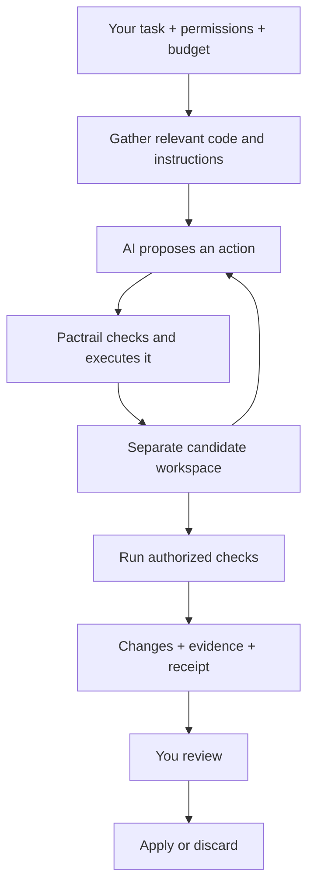

# Pactrail Architecture, Explained Simply

Pactrail is a system that lets an AI work on your code while controlling what it can touch, how much it can spend, and what evidence it must leave behind.

Think of the model as a developer you hired. Pactrail supplies the brief, the relevant documents, the tools, a separate workbench, spending limits, and a review process. The quality of the result depends on both the developer and that working environment.

The architecture is designed to make that environment predictable.

## How a Task Moves Through Pactrail

## 1. Your Request Becomes a Concrete Agreement

“Fix this bug” is the goal. Pactrail also records the workspace, allowed write locations, permissions, budgets, and conditions the task should satisfy.

That agreement follows the run through execution, recovery, and review. A model saying “I need more permission” cannot grant itself that permission.

**The intuition:** you give the developer a job description and access badge before work begins.

## 2. Pactrail Prepares a Useful Reading Packet

Sending an entire repository to the model would be expensive and often confusing. Pactrail builds a map of files, definitions, imports, and references, then selects relevant material within a budget.

It includes repository instructions, relevant current code, and eligible memories from earlier work. It checks current file contents so cached analysis cannot quietly supply outdated code.

**The intuition:** a librarian finds the useful pages before the developer starts reading. This can reduce unnecessary exploration, although selecting useful context still does not guarantee a correct fix.

## 3. Models Connect Through Adapters

The engine uses a common conversation and action format. Provider adapters translate it into OpenAI-compatible, OpenAI Responses, Anthropic, or Gemini requests. Local models can connect through supported compatible endpoints.

Runtime limits depend on declared capabilities—such as context size and parallel tool support—rather than special treatment based on a model’s name. Models without native tool calling can use a structured text action format that passes through the same checks.

**The intuition:** different developers can use the same workbench.

Model independence means the surrounding controls travel with the model. It does not mean every model will perform equally well.

## 4. Every Proposed Action Goes Through the Tool Kernel

When the model asks to read, search, edit, or execute something, Pactrail checks the request’s shape, permissions, paths, and limits.

Independent safe reads can run together. Edits and other consequential actions preserve execution order. Process execution has explicit modes: disabled, native host execution, or a restricted container.

**The intuition:** the model requests a tool; Pactrail controls the tool cabinet.

The selected mode matters. Native execution runs on your host; the restricted container supplies a stronger containment boundary.

## 5. Edits Happen on a Separate Workbench

The model edits an isolated candidate copy. Your source files remain behind the explicit Apply boundary.

Before applying, Pactrail checks that the candidate matches the reviewed receipt and that the touched source files still match their original baseline. If you edited a file during the run, Pactrail refuses to overwrite those changes blindly.

Applying also uses a journal and recovery procedure to handle interrupted writes.

**The intuition:** the developer prepares a proposed renovation, and you approve the exact plan before it reaches the building.

## 6. The Controller Manages Progress and Spending

Pactrail guides the run through investigation, implementation, validation, and synthesis. It detects repeated evidence and reminds a stalled model to make a supported edit, identify one missing fact, or report a blocker.

The tool catalog stays stable across phases. This preserves access to needed tools and helps maintain a stable prompt prefix that providers may cache.

For long conversations, Pactrail removes duplicate observations and replaces older bulky results with compact references. The original observations remain retrievable from run artifacts.

With complete price cards, it also reserves estimated request cost before calling the model and records actual reported usage afterward. Optional routing can use a cheaper investigation model and escalate when progress stalls.

**The intuition:** a project manager watches the clock, the bill, and whether work is moving forward. These controls reduce opportunities for waste; their actual savings need measurement.

## 7. Checks Produce Evidence Tied to the Exact Changes

Authorized verification runs against a disposable snapshot of the candidate. Build artifacts and test caches therefore stay outside the proposed patch.

Pactrail distinguishes existing repository tests from task-specific acceptance checks. Passing the existing suite may show that nothing obvious broke while leaving the requested behavior unproven.

A subsequent edit changes the candidate’s identity, so an earlier passing check cannot silently certify the new version.

**The intuition:** the inspection report identifies the exact version inspected and the questions it actually answered.

## 8. The Run Leaves a Recoverable Record

Important events form a hash-linked journal. Checkpoints preserve the conversation, candidate identity, permissions, budgets, and execution state.

When recovery can safely continue, Pactrail resumes from a verified boundary. If a crash leaves uncertainty about whether a consequential action finished, it refuses automatic replay.

Memories from applied runs also carry file fingerprints. Outdated memories are withheld when those fingerprints no longer match.

**The intuition:** there is a flight recorder, and recovery checks where the aircraft actually stopped before restarting anything. A valid record proves consistency of the history; it does not prove the code is correct.

These mechanisms and their boundaries are documented in [Pactrail’s technical architecture](docs/architecture.md).

## Where Pactrail Can Have an Advantage

Pactrail’s strongest architectural proposition is the combination of controlled execution, isolated changes, evidence, and recovery:

| When you care about… | Pactrail’s useful design choice |
| --- | --- |
| Protecting work already in progress | Isolated candidate plus source-drift checks before Apply |
| Knowing what was actually verified | Evidence tied to candidate contents and specific obligations |
| Recovering after interruption | Verified checkpoints and refusal to replay uncertain effects |
| Keeping long runs affordable | Bounded context, duplicate removal, retrievable observations, and cost accounting |
| Switching model providers | Common engine contracts with provider-specific adapters |
| Reviewing consequential work | A change receipt and explicit Apply boundary |

Other harnesses already have valuable features in these areas. Aider has repository maps and Git-based review and undo; OpenCode has permissions, policies, and conversation compaction. Those features alone do not establish Pactrail’s superiority. See [Aider repository maps](https://aider.chat/docs/repomap.html), [Aider Git integration](https://aider.chat/docs/git.html), [OpenCode policies](https://opencode.ai/v2/docs/policies/), and [OpenCode compaction](https://opencode.ai/v2/docs/compaction).

## What the Evidence Actually Shows

**We have not yet proven that current Pactrail is the better coding agent overall.** Architecture completion and successful bug fixing are separate achievements.

The retained results make this clear:

- An earlier small matched suite recorded Pactrail passing **42/42 trials**, with **59% fewer reported tokens** than the tested OpenCode version.
- A harder later comparison recorded Pactrail passing **0/6 functional trials**, versus OpenCode’s **2/6**. Pactrail spent less, but unsuccessful work is not a win.
- The recent Space Bunny calibration produced a focused patch and preserved isolation and trace integrity, but the hidden test found an incomplete fix.

Those reports are available in the [earlier comparison](benchmarks/results/2026-07-18-deepseek-v4/README.md), [harder comparison](benchmarks/results/2026-07-22-v1-confirmation/README.md), and [recent calibration](benchmarks/results/2026-09-26-space-bunny-v4-calibration/README.md). The historical comparisons describe the tested versions and configurations; they do not establish the performance of the current V2 architecture.

Pactrail has a strong foundation for controlled, auditable coding work. Its main remaining proof is reliable completion of difficult tasks at a competitive cost. The V2 upgrades address known causes of wasted investigation and weak verification, but a fresh comparative evaluation must establish how much those changes improved real results.

## Experimental collaboration in v2.1

Think of several specialists sitting beside one workshop supervisor. Each has
its own notes. The localizer looks for relevant code; the solver proposes a fix;
the critic challenges it; the implementer asks the supervisor to make changes.
Pactrail's kernel still decides which actions are permitted and performs them in
the isolated copy. Calling a model an implementer does not give it filesystem
access. Actual tests, files and tool observations supply evidence.

The first profile runs these specialists in a fixed order with finite turns,
rounds and communication limits. Text advice is stored and addressed to the next
specialist. An experimental latent extension can transport compatible internal
model state by checked binary artifact instead of generating a peer-language
message. The bundled providers do not expose that state and reject latent mode.
A CPU mock checks the machinery; a real-model adapter and causal experiments are
still needed to establish useful latent reasoning. This makes no claim of free
inference or better task performance. See [the specification](docs/multi-agent.md).
